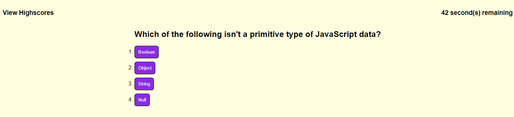

# Coding Quiz

## Description

This project is an interactive quiz to test the user's knowledge of JavaScript-related coding questions. The webpage features the use of setIntervals, querySelectors, localStorage, and eventListeners.

## Usage

When the user clicks 'Start Game' they will be presented with a random sequence of coding-related questions. The quiz has a time limit of 60 seconds, and 5 seconds is removed from the timer with each incorrect answer. Once all questions have been answered (or time runs out), the user will be presented with their score (seconds left), and then prompted to enter their initials. If the score is high enough, the users initials will be saved to the high score list.

Below is a screenshot of what the website might look like while it is in use.

## Credits

CSS Reset file courtesy of [meyerweb.com](http://meyerweb.com/eric/tools/css/reset/ ). v2.0 | 20110126 License: none (public domain)